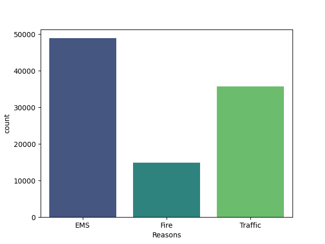
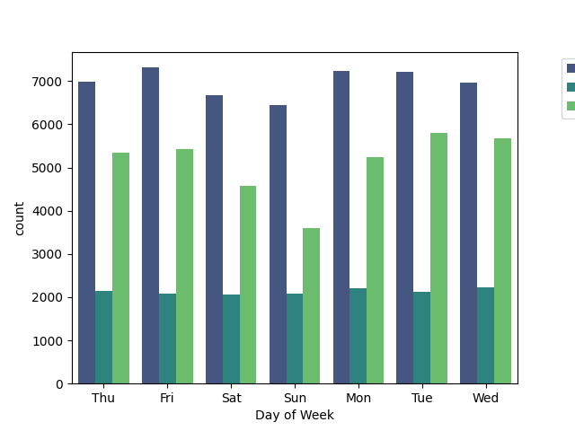
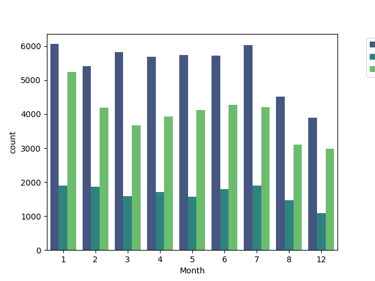
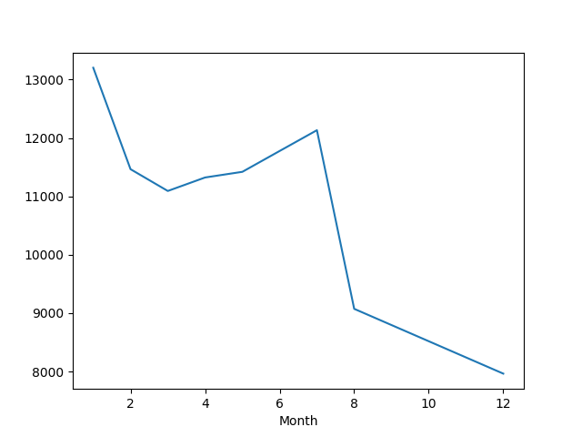
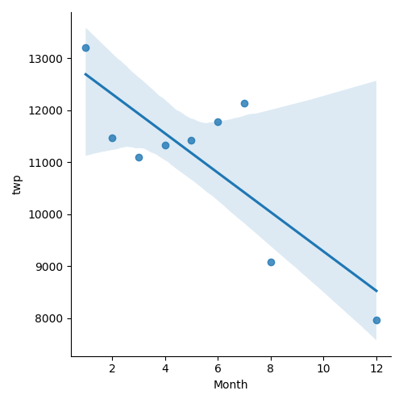
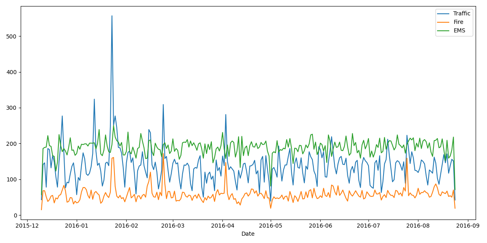
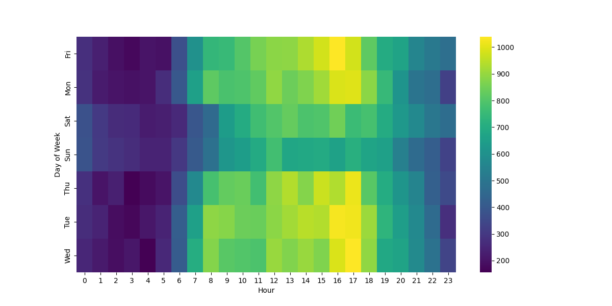
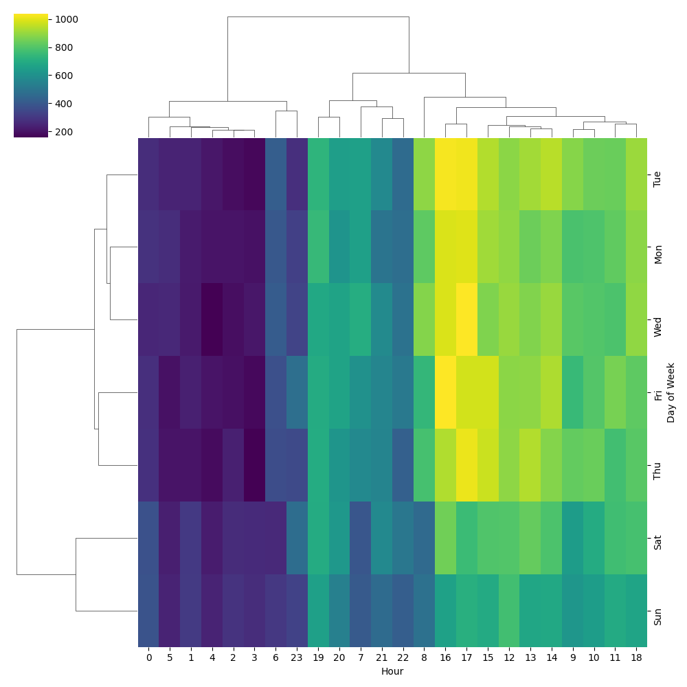
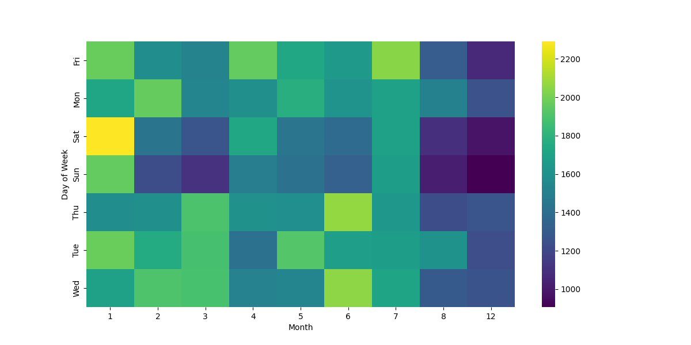
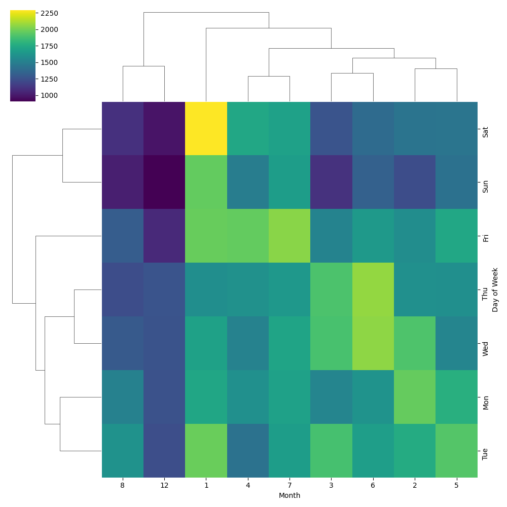

# Data_Visualization_911_Calls
Data visualization of 911 emergency calls

## Run Locally

  

1. Clone the project

  

```bash

git clone https://github.com/sameeksha15/Data_Visualization_911_Calls.git

```

  

2. Go to the project directory

  

```bash

cd Data_Visualization_911_Calls

```

  

3. Create virtual environment

  

```bash

python -m venv venv

```

  

4. Activate virtual environment

  

- For Windows

```bash

.\venv\Scripts\activate

```

  

- For Unix

```bash

./venv/bin/activate

```

  

5. Install dependencies

  

```bash

pip install -r requirements.txt

```

  

6. Run the jupyter notebook

  

```bash

jupyter notebook .

```

## Dataset

|index|lat|lng|desc|zip|title|timeStamp|twp|addr|e|
|---|---|---|---|---|---|---|---|---|---|
|0|40\.2978759|-75\.5812935|REINDEER CT & DEAD END;  NEW HANOVER; Station 332; 2015-12-10 @ 17:10:52;|19525\.0|EMS: BACK PAINS/INJURY|2015-12-10 17:40:00|NEW HANOVER|REINDEER CT & DEAD END|1\.0|
|1|40\.2580614|-75\.2646799|BRIAR PATH & WHITEMARSH LN;  HATFIELD TOWNSHIP; Station 345; 2015-12-10 @ 17:29:21;|19446\.0|EMS: DIABETIC EMERGENCY|2015-12-10 17:40:00|HATFIELD TOWNSHIP|BRIAR PATH & WHITEMARSH LN|1\.0|
|2|40\.1211818|-75\.3519752|HAWS AVE; NORRISTOWN; 2015-12-10 @ 14:39:21-Station:STA27;|19401\.0|Fire: GAS-ODOR/LEAK|2015-12-10 17:40:00|NORRISTOWN|HAWS AVE|1\.0|
|3|40\.116153|-75\.343513|AIRY ST & SWEDE ST;  NORRISTOWN; Station 308A; 2015-12-10 @ 16:47:36;|19401\.0|EMS: CARDIAC EMERGENCY|2015-12-10 17:40:01|NORRISTOWN|AIRY ST & SWEDE ST|1\.0|
|4|40\.251492|-75\.6033497|CHERRYWOOD CT & DEAD END;  LOWER POTTSGROVE; Station 329; 2015-12-10 @ 16:56:52;|NaN|EMS: DIZZINESS|2015-12-10 17:40:01|LOWER POTTSGROVE|CHERRYWOOD CT & DEAD END|1\.0|

<br/>

## OUTPUT 

- Plot for value counts of "Reasons for 911 Calls"
<br/>

[]()

<br/>
<br/>

- Plot for value counts of "911 Calls on each day of the week"
<br/>

[]()

<br/>
<br/>

- Plot for value counts of "911 Calls in every month of the year"
<br/>

[]()

<br/>
<br/>

- Plot for "Trend in the number of 911 Calls over the year"
<br/>

[]()

<br/>
<br/>

- Linear model plot to create a linear fit on the number of calls per month
<br/>

[]()

<br/>
<br/>

- Plot for "Trend in the number of 911 Calls over the year based on Reasons"
<br/>

[]()

<br/>
<br/>

- Heatmap for "Correlation between Day of the week and Hour of the day"
<br/>

[]()

<br/>
<br/>

- Clustremap for "Correlation between Day of the week and Hour of the day"
<br/>

[]()

<br/>
<br/>

- Heatmap for "Correlation between Day of the week and Month of the year"
<br/>

[]()

<br/>
<br/>

- Clustermap for "Correlation between Day of the week and Month of the year"
<br/>

[]()

